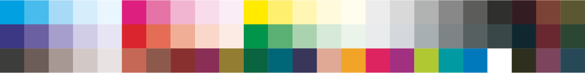

# MediaWedger

A tool to create tone value patches from characterisation data in Adobe InDesign.

## Data

### Medienkeil3_Sollwerte
Standard values of the 72 media wedge patches of Fogra Media Wedge CMYK V3.0

More info at [fogra.org](https://www.fogra.org/en/fogra-standardization/fogra-characterizationdata/a-icc-en.html)
